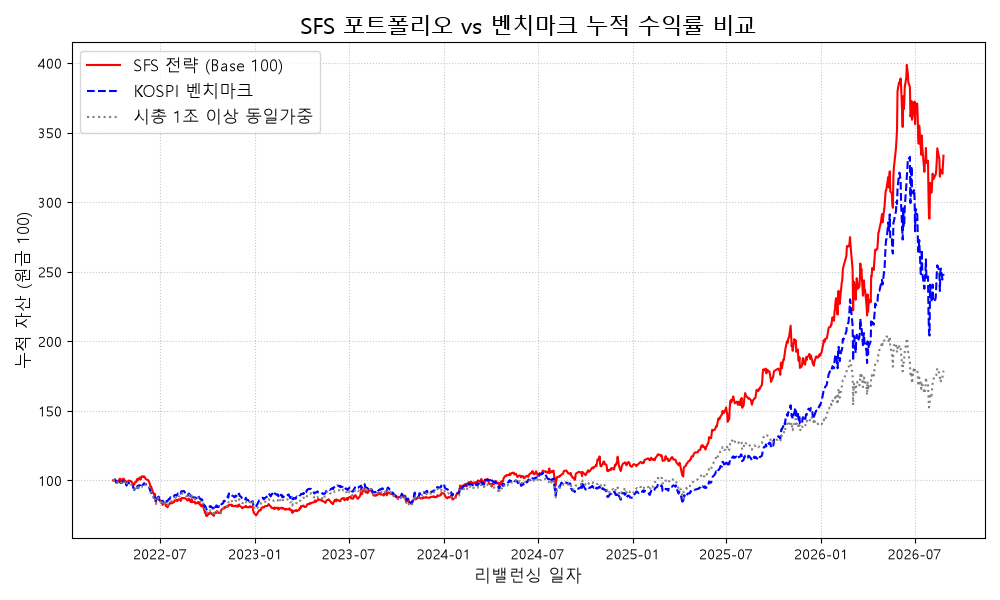
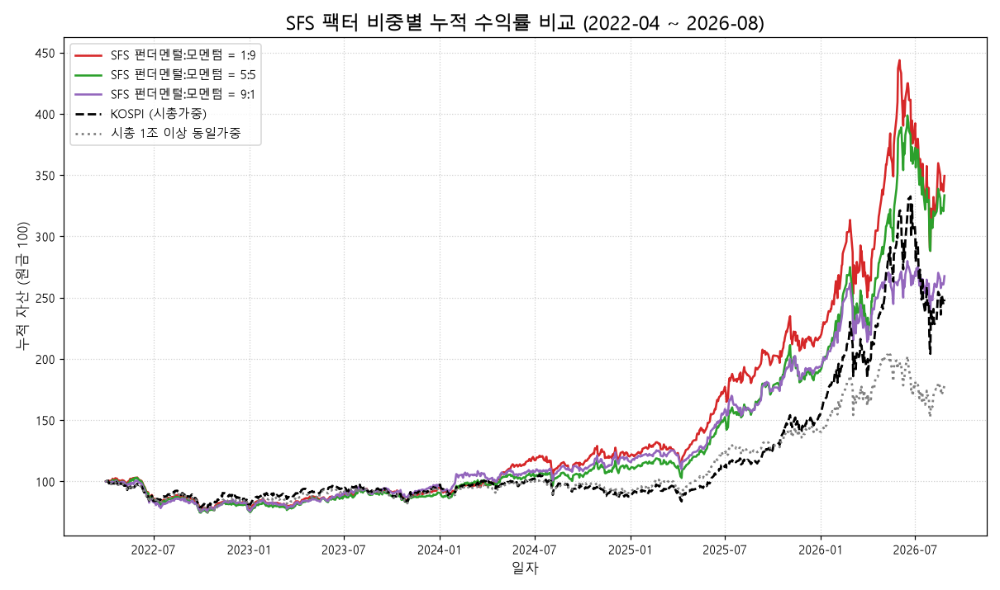

# SFS (Sequential Factor Screening)

## 기획 의도

KOSPI 대형주를 대상으로 **"퀄리티가 좋은 주식 중에서 모멘텀까지 붙은 종목을 걸러내 보자"**는 아이디어에서 출발한 퀀트 팩터 스크리닝·백테스트 엔진입니다. 핵심 파이프라인은 **2단계 순차 스크리닝**으로 설계했습니다.
DART 전자공시에서 재무 데이터를, KRX에서 시세와 상장주식수를 직접 수집해 로컬에 저장하고, 이를 바탕으로 팩터 기반 종목 스코어링과 분기별 리밸런싱 백테스트를 수행합니다.

1. **1차: 퀄리티·밸류로 펀더멘털 필터링** — 수익성·재무건전성·밸류에이션 기준으로 전체 유니버스의 상위 50%만 남깁니다.
2. **2차: 그 생존군 안에서만 모멘텀 필터링** — 1차를 통과한 종목만 대상으로 주가·이익 모멘텀을 다시 산출하고, 상위 50%로 한 번 더 좁힙니다.

즉 모멘텀은 아무 종목에나 적용되지 않고, **이미 펀더멘털 검증을 통과한 종목 안에서만** 타이밍 신호로 쓰입니다. 프로젝트명(Sequential Factor Screening)도 이 순차적 구조에서 따왔습니다.

### 참고한 연구와 반영 방식

두 권의 퀀트 투자 문헌에서 설계의 출발점을 얻었습니다. 각각에서 무엇을 가져왔고 한국 시장에 맞춰 어떻게 바꿨는지 정리하면 다음과 같습니다.

**James O'Shaughnessy, _What Works on Wall Street_**

| 참고한 부분                                                                           | SFS에 반영한 방식                                                                                                                                                                  |
| ------------------------------------------------------------------------------------- | ---------------------------------------------------------------------------------------------------------------------------------------------------------------------------------- |
| PER 하나만 보는 것보다 **여러 밸류지표를 함께 쓴 순위**가 더 안정적이었다는 검증 결과 | 밸류 점수를 PER·PBR·PCR·주주수익률 네 지표의 가중합으로 계산합니다. 한 지표만으로 순위를 매기지 않습니다.                                                                          |
| 배당과 자기주식 취득을 합한 **주주수익률**을 밸류지표의 하나로 사용                   | 밸류 섹션에 그대로 넣고, 퀄리티 섹션에는 그 증가율(환원금인상률)을 넣었습니다. 지금 얼마를 돌려주는지와, 그 금액이 늘고 있는지를 따로 봅니다.                                      |
| **밸류지표로 먼저 좁힌 뒤 그 안에서 주가 모멘텀**을 보는 순차 구조 (Trending Value)   | 이 2단계 순서를 파이프라인 구조로 채택했습니다. 먼저 펀더멘털로 후보를 줄이고, 남은 종목에만 모멘텀을 적용합니다. 단 1차 필터에 밸류지표뿐 아니라 **퀄리티지표까지 포함**했습니다. |

**Wesley Gray & Jack Vogel, _Quantitative Momentum_**

| 참고한 부분                                                                                       | SFS에 반영한 방식                                                                                                                                      |
| ------------------------------------------------------------------------------------------------- | ------------------------------------------------------------------------------------------------------------------------------------------------------ |
| 모멘텀은 크기만이 아니라 **경로의 질**이 중요하다는 관점 (급등 한 번보다 꾸준한 상승이 더 지속됨) | 주가 모멘텀을 단순 수익률이 아닌 **위험조정수익률**로 산출. 위험을 전체 변동성과 하락 변동성의 혼합으로 정의해, 덜 흔들리며 오른 종목에 높은 점수 부여 |
| 단기 반전을 피하고 **중기 구간**을 보되 여러 기간을 함께 검증                                     | 3·6·9·12개월 네 기간을 각각 산출해 균등 가중                                                                                                           |
| 모멘텀 종목군을 **2단계로 걸러내는** 접근                                                         | 모멘텀 팩터 자체를 컷오프한 뒤, 생존 그룹 안에서 다시 Z-스코어를 계산(Re-Z-scoring)해 최종 순위 산출                                                   |

**직접 추가한 부분**

- **OP 가속도 모멘텀**: 두 문헌의 모멘텀은 모두 주가 기반입니다. SFS는 영업이익 증가 속도의 변화(2차 차분)를 별도 섹션으로 두어, 주가와 실적 양쪽에서 모멘텀을 확인합니다.
- **금융기업 / 일반기업 이원화**: 국내 금융업의 재무제표 구조와 DART 공시 특성을 반영해 지표 구성과 가중치를 분리했습니다.
- **주주환원금의 한국 공시 기준 정의**: 별도재무제표 기준, 비지배지분·신종자본증권 배당 제외 (아래 [데이터 정합성 검증](#데이터-정합성-검증) 참고).

## 방법론

### 업종 분류 기준 (금융기업 / 일반기업)

파이프라인의 첫 분기점은 종목을 **금융기업과 일반기업으로 나누는 것**입니다. DART 기업개황 API(`company()`)가 제공하는 `induty_code`를 사용하는데, 이는 통계청 **한국표준산업분류(KSIC)** 코드로, `64`(금융업)·`65`(보험 및 연금업)·`66`(금융 및 보험관련 서비스업)로 시작하면 "금융기업", 그 외는 "일반기업"으로 분류합니다(KSIC 대분류 K "금융 및 보험업"의 중분류 세 개). **구분하는 이유**: 일반기업과 금융기업은 재무제표의 구조가 다르기 때문입니다. 예를 들어 은행·보험사에서는 예금·보험계약부채 같은 부채가 곧 영업 자산이고, 영업활동현금흐름과 설비투자도 일반기업과 같은 의미가 아닙니다. 같은 지표를 그대로 적용하면 값이 왜곡되므로 금융기업에는 아래처럼 다른 지표 구성을 적용합니다.

- **퀄리티**: 발생액·FCF/부채 대신 **ROE**를 사용
- **밸류**: 영업현금흐름 기반의 **PCR을 제외**하고, 주주수익률 비중을 2배로 둠
- **데이터 수집**: 영업현금흐름·설비투자 항목은 수집하지 않음
- **표준화**: 섹터 전용 지표(발생액·FCF/부채·PCR·ROE)는 해당 섹터 안에서만 Z-스코어를 계산해, 서로 다른 성격의 기업끼리 비교되지 않도록 함

### 7단계 파이프라인

`main.py`가 아래 7단계를 순서대로 호출하고, `sfs_backtest.py`는 이 전체 과정을 분기별 리밸런싱 날짜마다 반복해 시계열 성과를 시뮬레이션합니다.

| 단계                 | 내용                                                                                              |
| -------------------- | ------------------------------------------------------------------------------------------------- |
| 1. 유니버스          | KRX 시가총액 1조 원 이상 KOSPI 종목 스크리닝                                                      |
| 2. 데이터 빌더       | DART 공시 재무 데이터와 KRX 상장주식수를 로컬 JSON DB로 동기화 (주가는 `krx_cache/`에 별도 캐시)  |
| 3. 퀄리티 / 밸류     | 수익성(OP/자산)·재무건전성(발생액, FCF/부채)·밸류에이션(PER, PBR, PCR, 주주수익률) 원시 지표 산출 |
| 4. 펀더멘털 스코어링 | Z-스코어 표준화 → 계층적 가중합 → **상위 50% 컷오프**                                             |
| 5. 모멘텀            | **4단계 생존 종목만 대상으로** 주가 모멘텀·이익(OP) 모멘텀 산출                                   |
| 6. 모멘텀 스코어링   | Z-스코어 → **상위 50% 컷오프**                                                                    |
| 7. 최종 스코어링     | 최종 생존 그룹 안에서 모든 지표를 다시 Z-스코어화(Re-Z-scoring)해 종합 랭킹 산출                  |

컷오프 비율과 팩터별·섹션별 가중치는 `sfs_config.py` 한 곳에서 관리합니다.

## 팩터 · 섹션 · 지표 상세

점수는 **팩터 → 섹션 → 지표**의 3단 계층으로 계산하며, 모든 가중치와 컷오프는 `sfs_config.py`에서 조정합니다. 기본 설정은 각 계층 모두 균등 배분입니다.

```
종합 점수 (Grand Total Z)
├─ 펀더멘털 팩터 (50%)  → 상위 50% 컷오프
│   ├─ 퀄리티 섹션 (50%)  : OP/A · 환원금인상률 · 발생액 · FCF/부채 (금융: OP/A · ROE · 환원금인상률)
│   └─ 밸류 섹션 (50%)    : PER · PBR · PCR · 주주수익률 (금융: PER · PBR · 주주수익률)
└─ 모멘텀 팩터 (50%)    → 펀더멘털 생존 종목 안에서 상위 50% 컷오프
    ├─ 주가 모멘텀 섹션 (50%) : 3M · 6M · 9M · 12M 위험조정수익률
    └─ OP 가속도 섹션 (50%)   : 3M · 6M · 9M · 12M 영업이익 가속도
```

모든 재무 지표는 최근 4개 분기 합산(TTM, Trailing Twelve Months)을 기준으로 하며, 각 지표는 Z-스코어로 표준화해 서로 다른 단위를 같은 척도에서 합산합니다. **낮을수록 좋은 지표(발생액, PER, PBR, PCR)는 부호를 뒤집어** 항상 "Z가 클수록 좋다"로 통일합니다.

### 1. 펀더멘털 팩터 — 좋은 기업을, 싸게

#### 퀄리티 섹션 — 이익의 질과 재무 건전성

| 지표                      | 산식                                                                                       | 의미                                                                                                         | 방향              |
| ------------------------- | ------------------------------------------------------------------------------------------ | ------------------------------------------------------------------------------------------------------------ | ----------------- |
| **OP/A**                  | TTM 영업이익 ÷ 평균 총자산                                                                 | 자산을 얼마나 효율적으로 굴려 본업에서 이익을 내는가(총자산영업이익률)                                       | 높을수록 좋음     |
| **환원금인상률**          | TTM 주주환원금이 직전 분기 기준 TTM 대비 몇 % 늘었는가 (주주환원금 = 배당 + 자기주식 취득) | 이익을 주주에게 돌려주려는 의지와 여력의 변화                                                                | 높을수록 좋음     |
| **발생액** _(일반기업)_   | (TTM 순이익 − TTM 영업활동현금흐름) ÷ 평균 총자산                                          | 장부상 이익 중 현금이 뒷받침되지 않는 비중. 값이 크면 이익이 회계상 수치에 치우친 것으로 봄(발생액 이상현상) | **낮을수록** 좋음 |
| **FCF/부채** _(일반기업)_ | (TTM 영업활동현금흐름 − TTM 설비투자) ÷ 기말 총부채                                        | 실제로 남는 잉여현금흐름으로 부채를 감당할 수 있는가                                                         | 높을수록 좋음     |
| **ROE** _(금융기업)_      | TTM 순이익 ÷ 평균 자기자본                                                                 | 주주 자본 대비 수익성. 금융업은 부채가 영업 자산이라 FCF·발생액이 의미가 없어 ROE로 대체                     | 높을수록 좋음     |

#### 밸류 섹션 — 이익·자산·현금흐름 대비 주가 수준

| 지표                 | 산식                                       | 의미                                                                               | 방향              |
| -------------------- | ------------------------------------------ | ---------------------------------------------------------------------------------- | ----------------- |
| **PER**              | 주가 ÷ (TTM 순이익 ÷ 상장주식수)           | 이익 대비 주가. 적자(EPS ≤ 0)면 결측 센티널 `9999`를 부여                          | **낮을수록** 좋음 |
| **PBR**              | 주가 ÷ (최근 분기 자본 ÷ 상장주식수)       | 순자산 대비 주가                                                                   | **낮을수록** 좋음 |
| **PCR** _(일반기업)_ | 주가 ÷ (TTM 영업활동현금흐름 ÷ 상장주식수) | 회계 처리에 덜 좌우되는 현금흐름 대비 주가. 금융업은 영업현금흐름 개념이 달라 제외 | **낮을수록** 좋음 |
| **주주수익률**       | (TTM 배당 + 자사주 취득) ÷ 시가총액        | 투자자가 주가 대비 실제로 돌려받는 몫                                              | 높을수록 좋음     |

- 금융기업은 PER·PBR·주주수익률의 비중을 1:1:2로 두어 주주환원에 가중을 줍니다.
- 우선주는 재무제표를 본주와 공유하므로 **퀄리티는 본주끼리 계산한 뒤 우선주에 같은 값을 복사**하고, **밸류는 가격·주식수가 달라 우선주가 본주와 직접 경쟁**하도록 따로 계산합니다.

### 2. 모멘텀 팩터 — 펀더멘털을 통과한 종목 중, 흐름이 붙은 종목

#### 주가 모멘텀 섹션 — 위험조정수익률

기간(3·6·9·12개월)별로 `기간 수익률 ÷ 위험`을 계산합니다. 위험은 **전체 변동성 50% + 하락 변동성 50%**의 혼합으로, 상승이 클수록뿐 아니라 **덜 흔들리며 올랐을수록** 높은 점수를 받습니다(샤프 지수와 소르티노 지수의 절충). 기간이 다른 네 신호를 함께 봐서 단기 반짝 상승과 장기 추세를 모두 반영합니다. 거래일이 충분하지 않은 종목은 결측으로 처리합니다.

#### OP 가속도 섹션 — 영업이익의 증가세 자체가 붙고 있는가

영업이익 수준이 아니라 **증가 속도의 변화(2차 차분)**를 봅니다. 기간 길이(3·6·9·12개월)만큼을 한 블록으로 삼아 최근 세 블록의 영업이익 합 `B(T-2), B(T-1), B(T)`를 구한 뒤,

```
속도(T-1) = B(T-1) − B(T-2)        속도(T) = B(T) − B(T-1)
가속도 점수 = (속도(T) − 속도(T-1)) ÷ |속도(T-1)|      (±10으로 제한)
```

이익이 늘고 있고 그 증가폭마저 커지고 있는 종목이 높은 점수를 받습니다. 직전 속도로 나눠 정규화하므로 기업 규모와 무관하게 비교되고, 분모가 0에 가까울 때의 폭주는 ±10 클리핑으로 막습니다. 세 블록 중 한 분기라도 값이 없으면 결측입니다.

### 3. 스코어링 규칙

- **섹터별 표준화**: 일반기업 전용 지표(발생액·FCF/부채·PCR)와 금융기업 전용 지표(ROE)는 해당 섹터 안에서만 Z-스코어를 계산합니다.
- **결측 페널티**: 값을 구할 수 없는 지표는 Z-스코어 `-0.5`로 채워 "정보가 없으면 평균 이하로 본다"는 보수적 규칙을 적용합니다(상장 전 분기가 걸린 종목처럼 TTM 자체가 불완전하면 그 종목은 계산에서 제외).
- **최종 Re-Z-scoring**: 두 번의 컷오프를 통과한 생존 그룹 안에서 **모든 지표를 다시 Z-스코어화**한 뒤 가중합합니다. 전체 유니버스 기준 점수가 아니라 "최종 후보들끼리의 상대 순위"를 매기기 위해서입니다.

## 데이터 정합성 검증

퀀트 스코어링은 입력 데이터가 정확해야 의미가 있습니다. DART 공시 데이터를 실제로 다뤄보면 공식 API만 믿고 그대로 쓸 수 없는 지점이 여러 군데 있었고, 이를 하나씩 발견하고 실측으로 검증하며 고쳤습니다.

- **금융업 데이터 공백**: DART의 재무제표 API(`finstate_all`)는 은행·보험·증권 등 금융업종의 2023년 3분기 이전 재무제표를 아예 조회하지 못합니다(사업연도 전체가 0건으로 응답). 이 구간은 공시 원문(HTML)을 직접 파싱해 보강했습니다.
- **4분기 실적 역산**: 4분기는 별도 분기보고서가 없어 "연간 실적 − 3분기 누적"으로 역산해야 합니다. "연간 − (1·2·3분기 합)"으로 계산하면, 그중 한 분기라도 위 공백 구간에 걸릴 경우 그 분기 실적이 통째로 4분기에 잘못 얹힙니다. 실제로 한 금융지주사의 4분기 영업이익이 이 방식으로는 약 4,482억 원으로 계산됐지만, 실제 값은 약 3,042억 원이었습니다.
- **주주환원(배당·자사주)은 연결이 아닌 별도재무제표 기준**: 연결재무제표 기준 배당 지급액에는 종속회사가 지급한 배당까지 섞여 과대계상됩니다(예: 한 대형 제조사의 2024년 반기 배당 지급액이 연결 기준 5.98조 원, 별도 기준 4.90조 원으로 약 18% 차이). 여기에 비지배지분 배당과 신종자본증권 배당도 상장사 보통주주의 몫이 아니므로 별도로 제외했습니다.
- **계정과목명 표기 편차**: "영업이익"이라는 계정이 기업마다 "영업이익", "영업손실", "영업손익"(이익/손실 구분 없는 합성 표기)으로 다르게 표기되고, 번호가 접두어로 붙기도 합니다("Ⅳ.영업이익"). 완전일치로 계정을 찾으면 이런 표기를 놓쳐 값이 0으로 누락되는데, 실제로 이 문제 때문에 한 인터넷은행의 영업이익이 8개 분기 연속 0으로 잘못 집계된 것을 발견해 수정했습니다.

## 백테스트 결과

**설정**: 2022년 4월 ~ 2026년 6월 분기별 리밸런싱(매년 4·6·9·12월 첫 영업일), 최종 랭킹 상위 20종목 동일가중, 벤치마크 KOSPI(`^KS11`)

| 지표                | SFS 전략    | KOSPI   |
| ------------------- | ----------- | ------- |
| 누적 수익률         | **233.48%** | 148.49% |
| 연환산 수익률(CAGR) | **32.59%**  | 23.76%  |
| 최대낙폭(MDD)       | **-27.72%** | -38.63% |
| 샤프 지수(Sharpe)   | **1.17**    | 0.85    |



### 연도별 성과

누적 수익률만 보면 초과수익이 어디서 발생했는지 알 수 없어 연도별로 분해했습니다. **KOSPI는 시가총액 가중 지수인데 SFS는 20종목 동일가중**이라, 비교가 가중 방식 차이에서 오는 것인지 종목 선택에서 오는 것인지 구분하기 위해 **같은 유니버스(KOSPI 시총 1조 이상, 매 리밸런싱 시점 195~244종목)를 동일가중으로 보유하는 벤치마크**를 함께 계산했습니다. 아래에서는 이를 **시총 1조 이상 동일가중**이라고 부릅니다.

| 연도          | SFS          | KOSPI    | 시총 1조 이상 동일가중 | 추적오차 (vs KOSPI) | 정보비율 (vs KOSPI) |
| ------------- | ------------ | -------- | ---------------------- | ------------------- | ------------------- |
| 2022 (4~12월) | -22.90%      | -18.38%  | -19.30%                | 11.20%   | -0.40    |
| 2023          | +18.04%      | +18.73%  | +16.34%                | 14.64%   | -0.05    |
| 2024          | **+20.64%**  | -9.63%   | -3.54%                 | 15.94%   | **1.90** |
| 2025          | +72.84%      | +75.63%  | +55.44%                | 15.59%   | -0.18    |
| 2026 (1~8월)  | **+75.74%**  | +61.56%  | +27.08%                | 27.90%   | 0.51     |
| **누적**      | **+233.48%** | +148.49% | +78.91%                | 17.26%   | 0.51     |

추적오차는 SFS와 KOSPI의 일간 수익률 차이를 연율화한 값으로, 지수에서 얼마나 벗어나 움직였는지를 뜻합니다. 정보비율은 초과수익을 그 추적오차로 나눈 값이라 **감수한 이탈 위험 대비 얼마를 벌었는지**를 보여줍니다(누적 행은 CAGR 차이 기준). 2024년만 1.90으로 뚜렷하게 높고 나머지 해는 0 부근이거나 음수인데, 이는 초과수익이 꾸준히 쌓인 것이 아니라 특정 해에 몰렸다는 앞의 관찰과 같은 이야기입니다. 2026년 추적오차가 27.90%까지 뛴 것은 시장 자체의 변동성이 커진 영향입니다. 한편 전체 기간 SFS의 베타는 **0.74**로, 지수보다 덜 민감하게 움직이면서도 더 높은 수익을 냈습니다. 앞서 본 최대낙폭(-27.72% vs KOSPI -38.63%)과 같은 방향의 결과입니다.

### 차이의 원인 분석

초과수익은 전 기간에 고르게 쌓이지 않았습니다. **2024년과 2026년에 집중**되어 있고, 지수가 급등한 2025년에는 오히려 지수를 소폭 밑돌았습니다.

**① 시가총액 가중 vs 동일가중 (구조적 요인)** — 2024년 KOSPI는 -9.63%였지만 같은 유니버스를 동일가중하면 -3.54%였습니다. 즉 2024년 지수 하락의 상당 부분은 지수 내 비중이 큰 초대형 반도체주의 부진에서 왔고, 초대형주를 지수만큼 담지 않는 포트폴리오는 자연히 이를 비껴갑니다. 2024년 초과수익 30.27%p 중 약 6%p는 이 구조적 차이로 설명됩니다.

**② 종목 선택 효과 (팩터의 기여)** — 나머지는 종목 선택에서 왔습니다. 동일가중 벤치마크 대비 초과분(2024년 +24.17%p, 2025년 +17.40%p, 2026년 +48.67%p)은 가중 방식으로 설명되지 않는 부분입니다. 특히 **2025년은 지수를 2.79%p 밑돌았지만 동일가중 벤치마크는 17.40%p 앞섰습니다.** 지수 상승이 초대형주 주도였기 때문에(KOSPI +75.63% vs 동일가중 +55.44%) 지수 대비로는 뒤처졌을 뿐, 종목 선택 자체는 유효했다고 해석됩니다.

**③ 성과는 소수 종목에서 나왔고, 그중 상당수는 설계대로 걸러진 종목입니다.**

| 구간         | 종목             | 개별 수익률 | 포트폴리오 기여 | 구간 수익률 대비   |
| ------------ | ---------------- | ----------- | --------------- | ------------------ |
| 2024-09 ~ 12 | 고려아연         | +160.3%     | +8.02%p         | 구간 수익률의 92%  |
| 2026-04 ~ 06 | 삼성전기         | +351.1%     | +17.55%p        | 구간 수익률의 27%  |
| 2026-04 ~ 06 | LG이노텍         | +346.1%     | +17.30%p        | 구간 수익률의 27%  |
| 2023-06 ~ 09 | 포스코인터내셔널 | +162.1%     | +8.11%p         | 구간 수익률의 100% |

이 종목들이 **어떻게 편입됐는지**를 매수 직전 주가 흐름으로 확인하면 두 유형으로 갈립니다.

| 종목     | 매수 전 3M | 매수 전 6M | 매수 전 12M |
| -------- | ---------- | ---------- | ----------- |
| 삼성전기 | +74.3%     | +130.0%    | +245.4%     |
| LG이노텍 | +26.6%     | +82.0%     | +116.0%     |
| 고려아연 | +2.8%      | +21.1%     | +4.4%       |

삼성전기와 LG이노텍은 매수 시점에 이미 강한 상승 추세에 있었고, 모멘텀 팩터가 이를 골라낸 뒤 추세가 이어졌습니다. **펀더멘털만으로는 상위권에 오르지 않았을 종목을 모멘텀 단계에서 잡아낸 사례**로, 순차 스크리닝을 설계한 의도가 그대로 작동한 경우입니다.

고려아연은 경로가 다릅니다. 매수 시점(2024-09-02)의 섹션 점수를 보면 **주가 모멘텀은 -0.305로 최종 생존 48종목 중 하위권**이었고(상위 20종목 평균 +0.481), 대신 **OP 가속도가 +0.516으로 상위 17%**, 퀄리티가 상위 19%였습니다. 즉 주가 추세가 아니라 **영업이익 증가세가 가속되던 점**과 퀄리티가 편입을 끌어낸 종목이며, 최종 순위도 48종목 중 15위로 경계선에 가까웠습니다.

이 점에서 "실적이 개선 중인 우량주"를 골라낸 것까지는 팩터가 한 일입니다. 다만 매수 후 두 달 만에 주가가 두 배가 된 것(54.2만 원 → 99.8만 원)은 경영권 분쟁이라는 외생 이벤트가 만든 결과로, **+160%라는 상승 폭까지 팩터의 예측력으로 돌리기는 어렵습니다.** 2024년 성과를 해석할 때 유의해야 할 부분입니다.

한편 삼성전기와 LG이노텍은 같은 시점에 함께 편입된 **전자부품 업종**입니다. 모멘텀이 업종 단위로 형성되는 국면에서는 상위 20종목이 한 업종에 쏠릴 수 있고, 이번에는 그 방향이 맞았지만 반대 방향이면 손실도 같이 커집니다. 현재 파이프라인에는 업종 분산 제약이 없습니다.

**④ 승률은 높지 않습니다** — 전체 360건의 종목-구간 중 상승한 것은 184건(51.1%)이고, 18개 리밸런싱 구간 중 플러스는 12개입니다. 즉 **맞히는 비율이 아니라 크게 오르는 소수 종목이 성과를 만드는 구조**이고, 이는 모멘텀 전략의 전형적 수익 분포(양의 왜도)입니다. 반대로 하락장이었던 2022년에는 동일가중 벤치마크보다도 3.61%p 더 하락했는데, 모멘텀 팩터가 하락 국면에서 역효과를 낸 것으로 보입니다.

**⑤ 검증 기간의 한계** — 2022년 4월~2026년 8월은 약 4년 5개월이고, 그중 2025~2026년은 KOSPI가 4,214p에서 8,476p까지 오른 뒤 6,800p대로 되돌려진 극단적 국면입니다(최대낙폭도 이 시기에 발생). 하락장 표본이 2022년 한 해뿐이어서, 위 수치는 전략의 우월성을 입증한 결과가 아니라 **파이프라인이 실제 데이터로 끝까지 작동함을 확인한 1차 검증**으로 보는 것이 맞습니다. 업종 분산 제약, 가중치 민감도 분석, 거래비용 반영이 다음 과제입니다.

### 팩터 비중 민감도 분석

펀더멘털과 모멘텀의 비중(`WEIGHTS['Factors']`)을 1:9부터 9:1까지 바꿔가며 같은 기간을 재평가했습니다. 이 비중은 **step4·step6의 컷오프에는 영향을 주지 않고 step7 최종 랭킹에만 작용**하므로, 생존 종목군은 모든 설정에서 동일하고 그 안에서 뽑는 20종목만 달라집니다.

컷오프에 영향이 없는 것은 **팩터 비중뿐**이라는 점에 유의해야 합니다. 섹션 가중치(퀄리티:밸류, 주가:OP)와 지표 가중치는 step4·step6에서 컷오프 점수를 직접 만들기 때문에, 이들을 바꾸면 **생존 종목 자체가 달라집니다.** 따라서 그쪽 민감도를 보려면 조합마다 파이프라인을 처음부터 다시 돌려야 하고, 아래처럼 한 번의 실행 결과를 재가중하는 방식은 쓸 수 없습니다. 이 분석의 범위는 팩터 비중에 한정됩니다.



_그래프는 가시성을 위해 양 끝(1:9, 9:1)과 기본 설정(5:5)만 표시했습니다. 3:7과 7:3은 인접한 설정과 곡선이 거의 겹쳐 생략했으며, 다섯 설정의 수치는 아래 표에 모두 있습니다._

| 펀더멘털:모멘텀     | 누적 수익률  | CAGR       | MDD         | Sharpe   |
| ------------------- | ------------ | ---------- | ----------- | -------- |
| 1 : 9               | +249.40%     | 34.04%     | -35.07%     | 1.18     |
| 3 : 7               | **+263.23%** | **35.27%** | -31.81%     | **1.22** |
| 5 : 5 _(기본 설정)_ | +233.48%     | 32.59%     | -27.72%     | 1.17     |
| 7 : 3               | +144.85%     | 23.33%     | -26.89%     | 0.97     |
| 9 : 1               | +167.58%     | 25.92%     | **-25.29%** | 1.10     |
| KOSPI (시총가중)    | +148.49%     | 23.76%     | -38.63%     | 0.85     |
| 시총 1조 이상 동일가중 | +78.91%   | 14.59%     | -25.91%     | 0.71     |

**연도별 수익률**

| 연도          | 1:9        | 3:7        | 5:5        | 7:3        | 9:1     | KOSPI   | 동일가중 |
| ------------- | ---------- | ---------- | ---------- | ---------- | ------- | ------- | -------- |
| 2022 (4~12월) | -20.00%    | -20.18%    | -22.90%    | -23.33%    | -22.58% | -18.38% | -19.30%  |
| 2023          | 18.33%     | 14.57%     | 18.04%     | **26.23%** | 25.43%  | 18.73%  | 16.34%   |
| 2024          | **27.19%** | 26.25%     | 20.64%     | 15.23%     | 19.68%  | -9.63%  | -3.54%   |
| 2025          | 80.47%     | **81.70%** | 72.84%     | 67.28%     | 66.32%  | 75.63%  | 55.44%   |
| 2026 (1~8월)  | 60.79%     | 73.14%     | **75.74%** | 31.24%     | 38.42%  | 61.56%  | 27.08%   |

**해석**

**① 어떤 비중을 쓰든 시총 1조 이상 동일가중(+78.91%)을 크게 앞섭니다.** 종목 선택 효과는 비중 설정에 의존하지 않고 나타나며, 비중은 2차적인 선택입니다.

**② 수익률은 단조적이지 않습니다.** 모멘텀 비중이 높을수록 좋았다면 1:9가 최고여야 하지만 실제로는 3:7이 가장 높고, 7:3(+144.85%)은 오히려 9:1(+167.58%)보다 나쁩니다. 이 역전은 수익률 차이의 상당 부분이 신호가 아니라 표본 노이즈임을 시사합니다. **반면 MDD는 단조적입니다** — 모멘텀 비중이 커질수록 낙폭이 깊어집니다(-25.29% → -35.07%). 즉 이 축에서 신뢰할 수 있는 관계는 "수익"이 아니라 "위험"입니다.

**③ 차이가 제한적인 이유는 구조 때문입니다.** 팩터 비중이 컷오프에 관여하지 않으므로 모든 설정이 같은 생존군(유니버스의 약 25%)에서 종목을 고릅니다. 실제로 5:5 포트폴리오와 비교하면 1:9는 평균 15.8종목, 9:1은 13.4종목이 겹칩니다. 20종목 중 4~7종목만 다른 셈입니다.

앞서 적었듯 이는 팩터 비중에만 해당하며, 섹션·지표 가중치를 바꾸면 생존 종목 자체가 달라집니다.

**④ 다른 것은 업종 구성입니다.** 펀더멘털 비중이 커질수록 금융기업 편입이 늘어납니다(1:9에서 평균 5.9종목 → 9:1에서 9.0종목). 금융주가 저PBR·고배당 특성상 밸류와 주주수익률에서 높은 점수를 받기 때문입니다. 이 구성 차이가 국면별 우열을 가릅니다. 2023년에는 펀더멘털 편향(7:3 +26.23%)이 가장 좋았지만, 전자부품이 급등한 2026년에는 같은 조합이 +31.24%에 그쳐 5:5(+75.74%)에 크게 뒤집니다.

**⑤ 그래서 기본 설정(5:5)을 유지합니다.** 표본 내 최고는 3:7이지만, 비단조적 결과와 뚜렷한 국면 의존성을 감안하면 이 백테스트만으로 비중을 재조정하는 것은 과최적화에 가깝습니다. 5:5는 두 팩터에 대한 사전 판단을 그대로 반영한 중립 설정이고, 수익과 낙폭 사이에서도 중간에 위치합니다.

_과거 백테스트 성과이며 향후 수익을 보장하지 않습니다. 거래비용·슬리피지는 반영되지 않았습니다. 연도별 수치는 `sfs_trades_log.csv`의 보유 내역과 KRX 일별 시세로 일간 수익률 곡선을 복원해 역년(曆年) 기준으로 끊은 값이며, 누적 수익률은 백테스트 출력과 일치합니다._

## 실행 방법

```bash
git clone https://github.com/018lim/SFS.git
cd SFS
pip install -r requirements.txt
```

`.env` 파일에 아래 두 API 키를 설정합니다.

```
DART_API_KEY=your_dart_api_key
KRX_API_KEY=your_krx_api_key
```

```bash
python main.py                                              # 전체 파이프라인 실행 → Top 10 출력
python sfs_backtest.py --start_year 2022 --start_quarter 1   # 백테스트 실행
```

## 기술 스택

- **언어**: Python
- **데이터 수집**: [DART Open API](https://opendart.fss.or.kr/)(전자공시), [KRX Open API](https://data.krx.co.kr/)(시세), `OpenDartReader`, `pykrx`
- **공시 원문 파싱**: `BeautifulSoup`
- **데이터 처리**: `pandas`, `numpy`, `scipy`
- **시각화**: `matplotlib`

## License

[MIT](LICENSE)
